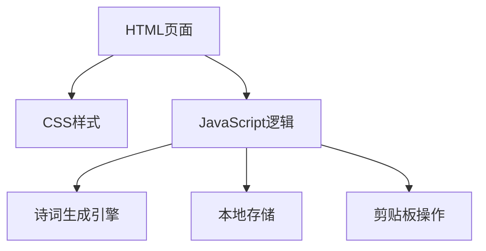

## 1. Architecture Design
纯前端架构，使用浏览器本地存储保存历史记录



## 2. Technology Description
- 前端：HTML5 + CSS3 + 原生JavaScript
- 初始化：纯静态文件，无需构建工具
- 后端：无（纯前端项目）
- 数据库：浏览器localStorage
- 字体：Google Fonts（Noto Serif SC）

## 3. 核心功能模块设计

### 3.1 诗词生成引擎
- 普通诗词生成：基于预设模板和随机词汇库
- 藏头诗生成：根据用户输入的关键词逐句生成
- 词汇库：包含常用的诗词词汇（名词、动词、形容词、量词等）

### 3.2 本地存储模块
- 保存用户生成的诗词历史
- 支持查看和删除历史记录
- 存储结构：`{ id, type, keywords, content, timestamp }`

### 3.3 UI交互模块
- 表单验证和参数处理
- 诗词展示和格式化
- 复制功能
- 响应式布局适配

## 4. 文件结构
```
/
├── index.html       # 主页面
├── styles.css       # 样式文件
└── script.js        # 逻辑文件
```

## 5. 诗词生成算法设计

### 5.1 数据结构
- 词汇库按词性分类存储
- 诗词模板包含句式结构和押韵规则
- 支持五言、七言绝句和律诗

### 5.2 生成流程
1. 解析用户输入参数（类型、关键词、字数）
2. 选择对应的诗词模板
3. 填充关键词到指定位置
4. 随机选择符合规则的其他词汇
5. 润色和格式化输出

## 6. 用户界面实现要点

### 6.1 视觉效果
- 使用宣纸纹理背景
- 实现优雅的书法字体效果
- 添加微妙的中国风装饰元素
- 流畅的动画过渡

### 6.2 响应式设计
- 使用Flexbox和Grid布局
- 媒体查询适配不同屏幕尺寸
- 触摸友好的交互设计
