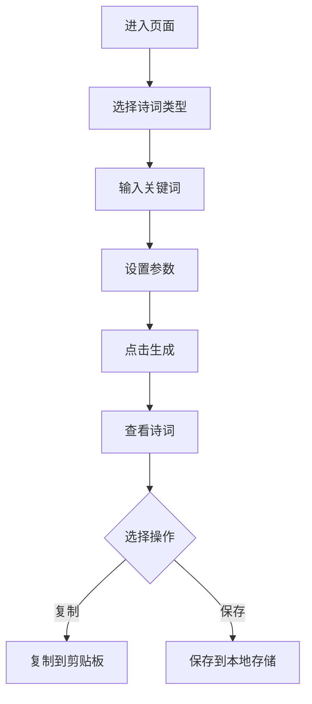

## 1. Product Overview
定制化AI诗词生成网页应用，支持普通诗词和藏头诗生成，可嵌入用户指定关键词，适合入门学习者使用
- 主要功能：提供便捷的诗词生成工具，让用户能够快速创建符合需求的诗词作品
- 目标：为诗词爱好者和初学者提供有趣且实用的创作辅助工具

## 2. Core Features

### 2.1 User Roles (if applicable)
无需用户角色区分，所有用户享有相同权限

### 2.2 Feature Module
1. **首页**：诗词生成功能区、作品展示区、历史记录区
2. **设置区**：诗词类型选择、字数调整、关键词输入

### 2.3 Page Details
| Page Name | Module Name | Feature description |
|-----------|-------------|---------------------|
| 首页 | 生成控制区 | 选择诗词类型（普通诗词/藏头诗），输入关键词，设置诗词字数，点击生成按钮 |
| 首页 | 作品展示区 | 展示生成的诗词，带复制和保存功能 |
| 首页 | 历史记录区 | 展示用户最近生成的作品 |

## 3. Core Process
用户进入页面 → 选择诗词类型 → 输入关键词和参数 → 点击生成按钮 → 查看生成的诗词 → 复制或保存作品

## 4. User Interface Design

### 4.1 Design Style
- **主色调**：水墨色系（米白背景，深灰文字，朱砂红点缀）
- **按钮风格**：圆角矩形，带有微妙的阴影和悬停效果
- **字体**：使用优雅的宋体/楷体风格字体搭配现代无衬线字体
- **布局风格**：卡片式布局，左右分栏，主区域居中突出
- **视觉元素**：加入传统中国风元素，如云纹、毛笔笔触装饰

### 4.2 Page Design Overview
| Page Name | Module Name | UI Elements |
|-----------|-------------|-------------|
| 首页 | 生成控制区 | 卡片设计，浅米色背景，圆角边框，柔和阴影 |
| 首页 | 作品展示区 | 宣纸质感背景，竖排文字展示，朱砂红印章装饰 |
| 首页 | 历史记录区 | 简洁列表，带删除按钮，悬停高亮 |

### 4.3 Responsiveness
桌面端为主，移动端自适应，在小屏幕上调整为单列布局

### 4.4 3D Scene Guidance (if applicable)
不适用
